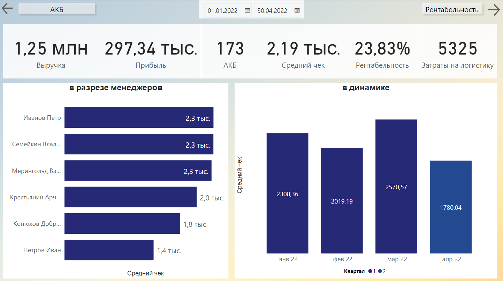

# Power BI

## Техническое задание

1.	Рассчитать показатели мерами:
-	Выручка;
-	Прибыль;
-	Рентабельность;
-	АКБ;
-	Средний чек;
-	Затраты на логистику
2.	 Создать графики:
-	Динамика показателей
-	Показатели в разрезе менеджеров

Реализованный отчет:

